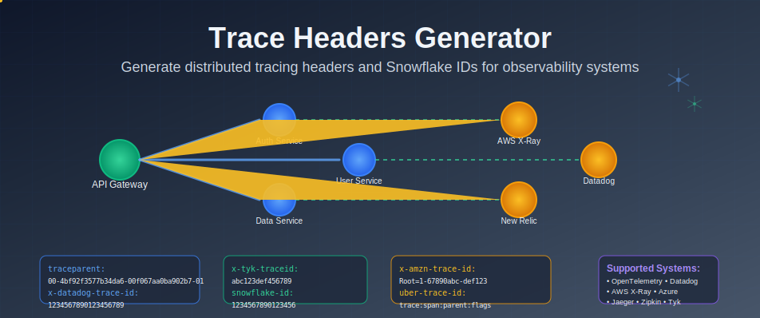

# Insomnia Trace Headers Plugin

A comprehensive Insomnia plugin for generating distributed tracing headers and Snowflake IDs for various APM and observability systems using cryptographically secure random number generation.

## Features

✅ **Cryptographically Secure**: Uses Node.js `crypto` module for generating random IDs  
✅ **Industry Standards**: Supports all major tracing and APM systems  
✅ **Snowflake IDs**: Twitter-style 64-bit distributed unique identifiers  
✅ **60+ Template Tags**: Comprehensive coverage of observability systems  
✅ **Configurable Options**: Customizable sampling, formats, and system-specific parameters  
✅ **Easy Integration**: Simple template tag interface  

## Installation

### Method 1: Local Development
1. Create a folder named `insomnia-plugin-trace-headers` in your Insomnia plugins directory:
   - **macOS**: `~/Library/Application Support/Insomnia/plugins/`
   - **Windows**: `%APPDATA%\Insomnia\plugins\`
   - **Linux**: `~/.config/Insomnia/plugins/`

2. Copy `package.json` and `app.js` into this folder
3. Restart Insomnia or the plugin will be automatically detected

### Method 2: Via Insomnia UI
1. Open Insomnia Preferences (cog icon)
2. Go to Plugins tab
3. Click "Generate New Plugin"
4. Enter "trace-headers" as plugin name
5. Replace the generated files with the provided `package.json` and `app.js`

## Usage

Once installed, you can use the template tags anywhere in Insomnia where template tags are supported (headers, body, query parameters, etc.).

To insert a template tag:
1. Press `Ctrl+Space` (or `Cmd+Space` on macOS) in any text field
2. Search for the desired trace header template tag
3. Configure the options if any are available

## Supported Systems

### OpenTelemetry / W3C Trace Context
- **W3C Traceparent**: Generates standard W3C traceparent headers
  - Format: `00-{128-bit-trace-id}-{64-bit-span-id}-{flags}`
  - Options: Version, Sampled flag
- **W3C Tracestate**: Vendor-specific trace state information

### Datadog APM
- **Datadog Trace ID**: Numeric trace identifier
- **Datadog Parent ID**: Numeric span/parent identifier  
- **Datadog Sampling Priority**: Sampling decision (-1 to 2)
- **Datadog Origin**: Origin of the trace (e.g., "synthetics")
- **Datadog Tags**: Environment and service tags

### AWS X-Ray
- **AWS X-Ray Trace ID**: Root trace identifier
  - Format: `Root=1-{timestamp}-{96-bit-random}`
- **AWS Request ID**: UUID format request identifier
- **AWS CloudFront ID**: CloudFront distribution trace ID
- **AWS ID 2**: S3-style secondary identifier

### Azure Application Insights
- **Azure Request ID**: UUID format request identifier
- **Azure Request Context**: Application context header
  - Format: `appId=cid-v1:{app-id}`
- **Azure Client Request ID**: Client-generated request identifier
- **Azure Correlation Request ID**: Cross-service correlation identifier

### Jaeger
- **Jaeger Trace ID**: Uber trace context format
  - Format: `{128-bit-trace-id}:{64-bit-span-id}:{64-bit-parent-id}:{flags}`
- **Jaeger Debug ID**: Debug trace identifier
- **Jaeger Baggage**: Key-value baggage information

### Zipkin B3
- **Zipkin B3 Trace ID**: Configurable 64-bit or 128-bit trace ID
- **Zipkin B3 Span ID**: 64-bit span identifier
- **Zipkin B3 Parent Span ID**: Parent span identifier
- **Zipkin B3 Sampled**: Sampling decision flag
- **Zipkin B3 Flags**: Additional tracing flags
- **Zipkin B3 Single Header**: Combined B3 header
  - Format: `{trace-id}-{span-id}-{sampled}`

### New Relic
- **New Relic Header**: Base64 encoded distributed tracing payload
- **New Relic ID**: Application identifier
- **New Relic Transaction**: Transaction identifier
- Options: Account ID, Application ID

### Google Cloud Trace
- **Google Cloud Trace Context**: GCP trace format
  - Format: `{128-bit-trace-id}/{span-id};o=1`
- **Google Trace**: Simplified Google trace header

### CloudFlare
- **CloudFlare Ray ID**: Ray ID with datacenter suffix
  - Format: `{64-bit-hex}-{datacenter}`
- **CloudFlare Request ID**: CloudFlare request identifier

### Sentry
- **Sentry Trace**: Sentry performance monitoring header
  - Format: `{32-char-trace-id}-{16-char-span-id}-{sampled}`
- **Sentry Baggage**: Environment and trace metadata

### Elastic APM
- **Elastic APM Traceparent**: W3C format for Elastic
  - Format: `00-{128-bit-trace-id}-{64-bit-span-id}-{flags}`
- **Elastic APM Tracestate**: Elastic-specific trace state

### Dynatrace
- **Dynatrace Header**: Dynatrace tracing format
  - Format: `FW4;{trace-id};{span-id};1;{app-id}`
- **Dynatrace Origin**: Dynatrace origin identifier

### AppDynamics
- **AppDynamics Header**: AppDynamics singularityheader format

### Honeycomb
- **Honeycomb Trace**: Honeycomb trace identifier
- **Honeycomb Dataset**: Dataset name for traces
- **Honeycomb Sample Rate**: Sampling rate configuration

### LightStep
- **LightStep Span Context**: LightStep span context header

### Istio/Envoy
- **Envoy Request ID**: Envoy-generated request identifier
- **Envoy Original Path**: Original request path before routing

### Tyk API Gateway
- **Tyk Trace ID**: Custom trace identifier for Tyk Gateway
  - Options: Hexadecimal (128-bit), UUID, or Numeric format
- **Tyk Request ID**: UUID format request identifier for Tyk
- **Tyk Authorization**: Management API authorization header
- **Tyk API Version**: API version header for versioned APIs
- **Tyk Base API ID**: Base API identifier for versioned APIs
- **Tyk Session ID**: Session identifier with "tyk-" prefix

### Snowflake IDs
- **Snowflake ID**: Twitter-style 64-bit distributed unique identifier
  - Options: Twitter, Discord, Unix, or custom epoch
  - Configurable machine/worker ID (0-1023)
- **Twitter Snowflake**: Official Twitter Snowflake format
  - Epoch: November 4, 2010, 01:42:54 UTC
- **Discord Snowflake**: Discord-compatible Snowflake format
  - Epoch: January 1, 2015, 00:00:00 UTC
- **Custom Snowflake**: Fully configurable Snowflake ID
  - Custom epoch and machine ID settings

### Generic/Custom Headers
- **Correlation ID**: Configurable correlation identifier
  - Options: UUID, 64-bit hex, 128-bit hex, or numeric format
- **Trace ID**: Generic trace identifier
- **Span ID**: Generic span identifier
- **Parent ID**: Generic parent identifier
- **Operation ID**: Operation identifier
- **Session ID**: Session identifier
- **User ID**: User identifier (numeric, UUID, or hex)
- **Tenant ID**: Multi-tenant identifier
- **Application ID**: Application identifier
- **Service ID**: Service identifier
- **Custom Trace Header**: Fully customizable format using placeholders
  - Placeholders: `{traceId}`, `{spanId}`, `{timestamp}`

## Example Usage

### Setting up W3C Traceparent Header
1. In your request headers, add a new header named `traceparent`
2. Press `Ctrl+Space` in the value field
3. Select "W3C Traceparent" from the template tags
4. Configure version (default: "00") and sampling (default: true)

### Setting up Multiple Datadog Headers
```
x-datadog-trace-id: 
x-datadog-parent-id: 
x-datadog-sampling-priority: 
x-datadog-origin: 
x-datadog-tags: 
```

### Setting up AWS X-Ray Headers
```
x-amzn-trace-id: 
x-amzn-requestid: 
x-amz-cf-id: 
```

### Setting up Zipkin B3 Headers
```
x-b3-traceid: 
x-b3-spanid: 
x-b3-parentspanid: 
x-b3-sampled: 
x-b3-flags: 
```

### Setting up Tyk API Gateway Headers
```
x-tyk-traceid: 
x-tyk-request-id: 
x-tyk-authorization: 
x-tyk-version: 
```

### Using Snowflake IDs
```
x-snowflake-id: 
x-twitter-snowflake: 
x-discord-snowflake: 
x-custom-snowflake: 
```

### Generic Trace Headers
```
x-correlation-id: 
x-trace-id: 
x-span-id: 
x-operation-id: 
x-user-id: 
```

### Custom Format Example
Use the "Custom Trace Header" template tag with format: `trace-{traceId}-span-{spanId}-ts-{timestamp}`

## Complete Header Reference

| System | Header Name | Template Tag |
|--------|-------------|--------------|
| W3C/OpenTelemetry | `traceparent` | `traceparent` |
| W3C/OpenTelemetry | `tracestate` | `tracestate` |
| Datadog | `x-datadog-trace-id` | `datadog_trace_id` |
| Datadog | `x-datadog-parent-id` | `datadog_parent_id` |
| Datadog | `x-datadog-sampling-priority` | `datadog_sampling_priority` |
| Datadog | `x-datadog-origin` | `datadog_origin` |
| Datadog | `x-datadog-tags` | `datadog_tags` |
| AWS X-Ray | `x-amzn-trace-id` | `aws_trace_id` |
| AWS | `x-amzn-requestid` | `aws_request_id` |
| AWS | `x-amz-cf-id` | `aws_cf_id` |
| AWS | `x-amz-id-2` | `aws_id_2` |
| Azure | `request-id` | `azure_request_id` |
| Azure | `request-context` | `azure_request_context` |
| Azure | `x-ms-client-request-id` | `azure_client_request_id` |
| Azure | `x-ms-correlation-request-id` | `azure_correlation_request_id` |
| Jaeger | `uber-trace-id` | `jaeger_trace_id` |
| Jaeger | `jaeger-debug-id` | `jaeger_debug_id` |
| Jaeger | `jaeger-baggage` | `jaeger_baggage` |
| Zipkin | `x-b3-traceid` | `zipkin_trace_id` |
| Zipkin | `x-b3-spanid` | `zipkin_span_id` |
| Zipkin | `x-b3-parentspanid` | `zipkin_parent_span_id` |
| Zipkin | `x-b3-sampled` | `zipkin_sampled` |
| Zipkin | `x-b3-flags` | `zipkin_flags` |
| Zipkin | `b3` | `zipkin_b3_single` |
| New Relic | `newrelic` | `newrelic_header` |
| New Relic | `x-newrelic-id` | `newrelic_id` |
| New Relic | `x-newrelic-transaction` | `newrelic_transaction` |
| Google Cloud | `x-cloud-trace-context` | `gcloud_trace_context` |
| Google Cloud | `x-goog-trace` | `goog_trace` |
| CloudFlare | `cf-ray` | `cloudflare_ray` |
| CloudFlare | `cf-request-id` | `cloudflare_request_id` |
| Sentry | `sentry-trace` | `sentry_trace` |
| Sentry | `baggage` | `sentry_baggage` |
| Elastic APM | `elastic-apm-traceparent` | `elastic_traceparent` |
| Elastic APM | `elastic-apm-tracestate` | `elastic_tracestate` |
| Dynatrace | `x-dynatrace` | `dynatrace_header` |
| Dynatrace | `x-dynatrace-origin` | `dynatrace_origin` |
| AppDynamics | `singularityheader` | `appdynamics_header` |
| Honeycomb | `x-honeycomb-trace` | `honeycomb_trace` |
| Honeycomb | `x-honeycomb-dataset` | `honeycomb_dataset` |
| Honeycomb | `x-honeycomb-samplerate` | `honeycomb_samplerate` |
| LightStep | `x-ot-span-context` | `lightstep_span_context` |
| Istio/Envoy | `x-request-id` | `envoy_request_id` |
| Istio/Envoy | `x-envoy-original-path` | `envoy_original_path` |
| Tyk Gateway | `x-tyk-traceid` | `tyk_trace_id` |
| Tyk Gateway | `x-tyk-request-id` | `tyk_request_id` |
| Tyk Gateway | `x-tyk-authorization` | `tyk_authorization` |
| Tyk Gateway | `x-tyk-version` | `tyk_version` |
| Tyk Gateway | `x-tyk-base-api-id` | `tyk_base_api_id` |
| Tyk Gateway | `x-tyk-session-id` | `tyk_session_id` |
| Snowflake | `x-snowflake-id` | `snowflake_id` |
| Twitter | `x-twitter-snowflake` | `twitter_snowflake` |
| Discord | `x-discord-snowflake` | `discord_snowflake` |
| Custom | `x-custom-snowflake` | `custom_snowflake` |
| Generic | `x-correlation-id` | `correlation_id` |
| Generic | `x-trace-id` | `trace_id` |
| Generic | `x-span-id` | `span_id` |
| Generic | `x-parent-id` | `parent_id` |
| Generic | `x-operation-id` | `operation_id` |
| Generic | `x-session-id` | `session_id` |
| Generic | `x-user-id` | `user_id` |
| Generic | `x-tenant-id` | `tenant_id` |
| Generic | `x-application-id` | `application_id` |
| Generic | `x-service-id` | `service_id` |
| Custom | (any name) | `custom_trace_header` |

## Security & Quality

This plugin uses Node.js built-in `crypto.randomBytes()` for generating all random values, ensuring:

- **Cryptographically secure random number generation**
- **High entropy** for trace and span IDs
- **No predictable patterns** in generated identifiers
- **Compliance** with security best practices for distributed tracing

All generated IDs have sufficient randomness to avoid collisions in distributed systems.

## Snowflake ID Format

Snowflake IDs are 64-bit integers used in distributed computing, originally created by Twitter. The format consists of:
- **1 bit**: Sign bit (always 0)
- **41 bits**: Timestamp (milliseconds since chosen epoch)
- **10 bits**: Machine/Worker ID (0-1023)
- **12 bits**: Sequence number (0-4095)

**Key Benefits:**
- **Time-sortable**: IDs are chronologically ordered
- **Distributed**: Multiple machines can generate IDs without coordination
- **High throughput**: Up to 4096 IDs per millisecond per machine
- **Collision-free**: Guaranteed uniqueness across distributed systems

**Common Epochs:**
- **Twitter**: November 4, 2010, 01:42:54 UTC (1288834974657)
- **Discord**: January 1, 2015, 00:00:00 UTC (1420070400000)
- **Custom**: Any timestamp you choose for your system

## Development

To extend this plugin:
1. Add new template tags to the `module.exports.templateTags` array in `app.js`
2. Each template tag needs: `name`, `displayName`, `description`, `args`, and `run` function
3. Use the helper functions for generating consistent ID formats
4. **Important**: Template tag names must use underscores (`_`) not hyphens (`-`)

## All Available Template Tags

Here's a complete list of all 60+ available template tags in this plugin:

### W3C/OpenTelemetry
- `traceparent` - W3C Trace Context
- `tracestate` - W3C Trace State

### Datadog APM
- `datadog_trace_id` - Datadog Trace ID
- `datadog_parent_id` - Datadog Parent ID
- `datadog_sampling_priority` - Datadog Sampling Priority
- `datadog_origin` - Datadog Origin
- `datadog_tags` - Datadog Tags

### AWS X-Ray & Services
- `aws_trace_id` - AWS X-Ray Trace ID
- `aws_request_id` - AWS Request ID
- `aws_cf_id` - AWS CloudFront ID
- `aws_id_2` - AWS ID 2

### Azure Application Insights
- `azure_request_id` - Azure Request ID
- `azure_request_context` - Azure Request Context
- `azure_client_request_id` - Azure Client Request ID
- `azure_correlation_request_id` - Azure Correlation Request ID

### Jaeger
- `jaeger_trace_id` - Jaeger/Uber Trace ID
- `jaeger_debug_id` - Jaeger Debug ID
- `jaeger_baggage` - Jaeger Baggage

### Zipkin B3
- `zipkin_trace_id` - Zipkin B3 Trace ID
- `zipkin_span_id` - Zipkin B3 Span ID
- `zipkin_parent_span_id` - Zipkin B3 Parent Span ID
- `zipkin_sampled` - Zipkin B3 Sampled
- `zipkin_flags` - Zipkin B3 Flags
- `zipkin_b3_single` - Zipkin B3 Single Header

### New Relic
- `newrelic_header` - New Relic Distributed Tracing
- `newrelic_id` - New Relic ID
- `newrelic_transaction` - New Relic Transaction

### Google Cloud
- `gcloud_trace_context` - Google Cloud Trace Context
- `goog_trace` - Google Trace

### CloudFlare
- `cloudflare_ray` - CloudFlare Ray ID
- `cloudflare_request_id` - CloudFlare Request ID

### Sentry
- `sentry_trace` - Sentry Trace Header
- `sentry_baggage` - Sentry Baggage

### Elastic APM
- `elastic_traceparent` - Elastic APM Traceparent
- `elastic_tracestate` - Elastic APM Tracestate

### Dynatrace
- `dynatrace_header` - Dynatrace Header
- `dynatrace_origin` - Dynatrace Origin

### AppDynamics
- `appdynamics_header` - AppDynamics Header

### Honeycomb
- `honeycomb_trace` - Honeycomb Trace
- `honeycomb_dataset` - Honeycomb Dataset
- `honeycomb_samplerate` - Honeycomb Sample Rate

### LightStep
- `lightstep_span_context` - LightStep Span Context

### Istio/Envoy
- `envoy_request_id` - Envoy Request ID
- `envoy_original_path` - Envoy Original Path

### Tyk API Gateway
- `tyk_trace_id` - Tyk Trace ID
- `tyk_request_id` - Tyk Request ID
- `tyk_authorization` - Tyk Authorization
- `tyk_version` - Tyk API Version
- `tyk_base_api_id` - Tyk Base API ID
- `tyk_session_id` - Tyk Session ID

### Snowflake IDs
- `snowflake_id` - General Snowflake ID
- `twitter_snowflake` - Twitter Snowflake
- `discord_snowflake` - Discord Snowflake
- `custom_snowflake` - Custom Snowflake

### Generic/Custom
- `correlation_id` - Correlation ID
- `trace_id` - Generic Trace ID
- `span_id` - Generic Span ID
- `parent_id` - Generic Parent ID
- `operation_id` - Operation ID
- `session_id` - Session ID
- `user_id` - User ID
- `tenant_id` - Tenant ID
- `application_id` - Application ID
- `service_id` - Service ID
- `custom_trace_header` - Custom Trace Header

## Important Notes

### Template Tag Naming Convention
- ✅ **Use underscores**: `datadog_trace_id`, `aws_trace_id`
- ❌ **Don't use hyphens**: `datadog-trace-id`, `aws-trace-id`
- This is a requirement for Insomnia template tag names

### Header Names vs Template Tag Names
- **Header names** use hyphens: `x-datadog-trace-id`
- **Template tag names** use underscores: `datadog_trace_id`
- Example: `x-datadog-trace-id: `

## Contributing

Feel free to submit issues and enhancement requests!

## License

MIT License